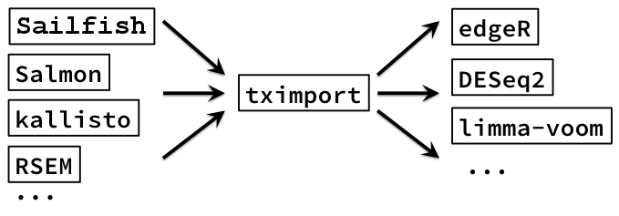

[R script](https://github.com/genomicsclass/labs/blob/master/rnaseq/rnaseq_gene_level.Rmd)

[book page](http://genomicsclass.github.io/book/pages/rnaseq_gene_level.html)

## DE assessment I

In this assessment we will perform a gene-level differential expression analysis of brain tissues vs all the other tissues. This is a somewhat strange analysis (one organ vs many organs/tissues), but we will hope to find some highly expressed genes unique to brain in the end, and then eventually we will look to see the annotation of these genes.

We will continue to use the 'dds' we prepared from the Wang et al dataset for the normalization and transformation assessment.

You can rebuild it with the following lines:

```{r}
download.file("http://bowtie-bio.sourceforge.net/recount/ExpressionSets/wang_eset.RData", "wang_eset.RData")
```

Note: if the file above is not available, you can also download wang_eset.RData hosted on our course.


```{r}
load("wang_eset.RData")
library(Biobase)
```

```{r}
count.matrix <- exprs(wang.eset)[,10:21]
col.data <- pData(wang.eset)[10:21,]
library(DESeq2)
dds <- DESeqDataSetFromMatrix(count.matrix, col.data, design=~cell.type)
```


Now we make a new factor column in the colData of dds, which is "brain" for the cerebellum and mixed brain samples, and "other" for the other samples. We set "other" as the reference level (the denominator for the fold changes).

```{r}
dds$type <- factor(ifelse(dds$cell.type %in% c("cerebellum","mixed.brain"), "brain", "other"))
dds$type <- relevel(dds$type, "other")
```

Now reset the design of the DESeqDataSet:

```{r}
design(dds) <- ~ type
```

Run the differential expression function, and create the default results table 'res' for comparing brain vs other.

```{r}
dds <- DESeq(dds)
res <- results(dds)
```
Examine the results table:

```{r}
head(res)
```

```{r}
table(res$padj < 0.1)
```
A summary of the results can be generated:

```{r}
summary(res)

```
For testing at a different threshold, we provide the alpha to results, so that the mean filtering is optimal for our new FDR threshold.

```{r}
res2 <- results(dds, alpha=0.05)
table(res2$padj < 0.05)
```
### Visualizing results

The MA-plot provides a global view of the differential genes, with the log2 fold change on the y-axis over the mean of normalized counts:

```{r}
plotMA(res) # default MA plot
```
Now make another MA plot, but this time expand ylim=c(-10,10). 

```{r}
plotMA(res,ylim=c(-10,10))
```

A log2 fold change of 10 is a fold change of 1024. Note that there are extreme log2 fold changes between brain and other tissues: this is expected as there are many genes which are expressed specifically in brain.

Find the gene with the smallest adjusted p-value in 'res'. 

```{r}
res[which.min(res$padj),]
resSort <- res[order(res$padj),]
head(resSort)
```

Use plotCounts to make a plot of the normalized counts for this gene. If the index (numeric or character) for this gene is 'type', then you can use the following code:

```{r}
plotCounts(dds, gene=which.min(res$padj), intgroup="type")
```

A more sophisticated plot of counts:

```{r}
library(ggplot2)
data <- plotCounts(dds, gene=which.min(res$padj), intgroup=c("type"), returnData=TRUE)
ggplot(data, aes(x=type, y=count, col=type)) +
  geom_point(position=position_jitter(width=.1,height=0)) +
  scale_y_log10()
```

### DE Q1

What is the name of the gene (ENSG...) with the smallest adjusted p-value in 'res'? The rownames of res give the Ensembl ID.

```{r}
rownames(res[which.min(res$padj),])
```

Now create a results table 'res2', but this time with a lfcThresold of 2. Note: you do not need to re-run DESeq().

This is equivalent to testing against a different null hypothesis, in this case to test for genes that have a fold change that rises  by more than a factor of 4 or less than 1/4.

```{r}
res2<-results(dds, lfcThreshold=2)
```
Make an MA-plot of res2 with ylim=c(-10,10).

```{r}
plotMA(res2,ylim=c(-10,10))
```
### DE Q2

(1 point possible)
Use summary() on the results table you just made which tested for absolute value of log2 fold changes larger than 2 (so a fold change of more than 4 or less than 1/4). How many genes in the set with FDR less than 0.1 have a positive LFC?

```{r}
summary(res2)
# or
table(res2$padj < 0.1 & res2$log2FoldChange > 0)
```

In the summary table, we can see there are a number of genes which were filtered for having low count, and for having outliers:

The DESeq2 software automatically filters low count genes, and chooses a threshold by optimizing the number of genes with adjusted p-value < alpha, an argument in results(). These filtered genes will get a NA for the adjusted p-value. The reason for this low count filtering is that multiple test correction (covered in PH525.3x) produces adjusted p-values which are larger than the original p-value. The amount that the adjusted p-value is raised depends on the number of tests. If we can remove genes which have no power to find differences (genes with very small counts, where the differences are obscured by noise), we can increase our overall power giving us smaller adjusted p-values. A review of this filtering strategy is presented in [Bourgon 2010](http://www.pnas.org/content/107/21/9546.long).

DESeq2 also filters (or with more samples, replaces) genes with extreme outlier counts. These genes receive an NA for both p-value and adjusted p-value. This dataset has a large number of outlier counts, because we have combined a number of tissues in the "other" group, though these are not truly biological replicates. If a single tissue in "other" has a large count, but the others have 0, this gene was likely filtered out. An experiment with two groups of proper biological replicates would have much fewer outliers (although technical outliers can still occur).
Both filters can be customized or turned off by the arguments listed in the summary() output.

We mentioned in the first week that gene counts are proportional to gene expression, as well as sequencing depth, average transcript length and other technical bias factors. In this analysis we accounted for sequencing depth changes across samples, and we assumed that the other factors cancelled out when calculating fold changes across samples. It is possible to account for these differences as well across samples, by using other software to estimate sample-specific bias parameters (e.g. the CQN or EDASeq package) and setting these normalizationFactors() before running DESeq(). 

We will continue with this DE analysis in the next assessment.

## DE assessment II: 

Continue using the results table 'res' from the brain vs other sample comparison (the one testing LFC not equal to 0).

Earlier, we made a counts plot for the gene with the smallest p-value:

```{r}
plotCounts(dds, which.min(res$padj), intgroup="type")
```

Make normalized counts plots for the top 9 genes:

```{r}
par(mfrow=c(3,3))
for (i in 1:9)  plotCounts(dds, order(res$padj)[i], intgroup="type")
```

These genes all look similar, with large counts for brain samples and small for the "other" group. Here we have empirically found a set of genes which seem specific (at least in our dataset) to brain. We examine their annotation below.

Now run the following to return to 1 plot at a time:

```{r}
par(mfrow=c(1,1))
```

Build a vector of the names of the top 20 genes by the test statistic (largest first). The test statistic is the LFC divided by its standard error, and uniquely determines the p-value. So this is the same as asking for the genes with the smallest p-value and positive LFC (so higher expression in brain).

```{r}
top <- rownames(res)[head(order(res$stat, decreasing=TRUE), 20)]
```
### DE II Q1 : Getting alternate annotations

Use org.Hs.eg.db to determine the gene symbol of the top gene in this list. What is the SYMBOL?

```{r}
library(AnnotationDbi)
library(org.Hs.eg.db)
anno <- select(org.Hs.eg.db, keys=top,columns="SYMBOL", keytype="ENSEMBL")
anno
anno$SYMBOL[1]
```

Answer: `anno$SYMBOL[1]`

### DE II Q2

Use org.Hs.eg.db to determine the GENENAME of the top genes. What is the GENENAME of the top gene?

```{r}
library(AnnotationDbi)
library(org.Hs.eg.db)
anno <- select(org.Hs.eg.db, keys=top,columns="GENENAME", keytype="ENSEMBL")
anno
anno$GENENAME[1]
```

Answer: `anno$GENENAME[1]`

You can use this link to search for more information about these genes by SYMBOL:

[NCBI gene search](http://www.ncbi.nlm.nih.gov/gene?term=%22homo%20sapiens%22%5BOrganism%5D)

What is the Summary after you search for the top gene by symbol?

## SVA

In this assessment, we will download a dataset which has 2 biological conditions (two inbred strains of mice) and 3 experimental batches, and see how well SVA does at detecting the batches. The code below downloads the data of Bottomly et al from the ReCount project:

```{r}
download.file("http://bowtie-bio.sourceforge.net/recount/ExpressionSets/bottomly_eset.RData", "bottomly_eset.RData")
```

Note: if the file above is not available, you can also download bottomly_eset.RData hosted on our course.


```{r}
load("bottomly_eset.RData")
library(Biobase) 
```

Now build a DESeqDataSet from this object:                                                                                                    

```{r}
count.matrix <- exprs(bottomly.eset)
col.data <- pData(bottomly.eset) 
library(DESeq2)
dds <- DESeqDataSetFromMatrix(count.matrix, col.data, design=~strain)
```

The "experiment.number" column is a numeric, so make sure to turn it into a factor:                                  
```{r}
dds$experiment.number <- factor(dds$experiment.number)
```

Estimate the size factors so we can get normalized counts later:

```{r}
dds <- estimateSizeFactors(dds)
```

Run the varianceStabilizingTransformation() on the dds and then make a PCA plot with c("strain","experiment.number") as the intgroup to label.

Another transformation for stabilizing variance in the DESeq2 package is `varianceStabilizingTransformation`. These two tranformations are similar, the `rlog` might perform a bit better when the size factors vary widely, and the `varianceStabilizingTransformation` is much faster when there are many samples.

```{r}
vsd <- varianceStabilizingTransformation(dds, blind=FALSE)
plotPCA(vsd, intgroup=c("strain","experiment.number"))
```

The strains have names "C57BL/6J" and "DBA/2J". 

The experiments are numbered 4, 6 and 7. We can see that both strain and experimental batch have an effect on the normalized, transformed counts.

Because we know the experimental batches, we could just use DESeq() with ~ experiment.number + strain to look for strain specific differences controlling for batch. But suppose we were given this data without the batch information. We could use SVA to try to identify the hidden structure.

Run SVA-seq to find 2 surrogate variables using the code shown in the previous video (the Rmd file is [here](https://github.com/genomicsclass/labs/blob/master/rnaseq/rnaseq_gene_level.Rmd)).

Use a design of ~ strain for the full model "mod" and ~ 1 for the reduced model "mod0".

```{r}
library(sva)
dat <- counts(dds, normalized=TRUE)
idx <- rowMeans(dat) > 1
dat <- dat[idx,]
mod <- model.matrix(~ strain, colData(dds))
mod0 <- model.matrix(~ 1, colData(dds))
svseq <- svaseq(dat, mod, mod0, n.sv=2)
```

Plot the surrogate variables and color by the true batches (remember, normally we wouldn't have this information if we needed to run SVA):

```{r}
plot(svseq$sv[,1], svseq$sv[,2], col=dds$experiment.number, pch=16)
legend("bottom", levels(dds$experiment.number), pch=16, col=1:3)
```

Now add numbers to each sample:

```{r}
text(svseq$sv[,1], svseq$sv[,2], 1:ncol(dds), pos=1)
```

### SVA Q1

Which sample (the number in the plot) from experiment number 6 is closest to the samples from experiment number 4, according to these two surrogate variables?

Answer: 18

## _tximport_

In the past two years (2014-2016), a number of new methods have emerged which allow for rapid quantification of transcript abundances, skipping the alignment step. Rapid can mean a few minutes to quantify abundances for each RNA-seq sample, and only a few Gb of RAM. This is a very attractive option for RNA-seq analysis, because alignment is an extra step in the process (STAR is very fast but still takes time), alignment results in large alignment files (BAM files, multiple Gb each), and then anyway, we require an extra step to count the alignments to the genes for each sample (taking ~10-30 minutes per sample for human RNA-seq).

The best way to understand how these new methods work is to read the papers. The first method was Sailfish, which was published in 2014 in Nature Biotechnology. You can read the paper here:

Sailfish: http://www.ncbi.nlm.nih.gov/pubmed/24752080

Since then, a method called kallisto (just recently published in Nature Biotechnology) and a method called Salmon (from the Sailfish authors) have also been released. The papers for these are publicly available here:

kallisto: http://arxiv.org/abs/1505.02710

Salmon: http://biorxiv.org/content/early/2015/10/03/021592

The reason I bring these software up in the context of RNA-seq differential gene expression, is that, these tools can be used to quickly generate gene count matrices, which can then be used by the gene-level differential expression packages such as DESeq2, edgeR, or limma-voom.



A paper describing this strategy is:

__Differential analyses for RNA-seq: transcript-level estimates improve gene-level inferences__, Charlotte Soneson, Michael I. Love, Mark D. Robinson
http://f1000research.com/articles/4-1521/v1

The Bioconductor software for importing the abundances from these tools, converting into gene-level counts is called "_tximport_" and can be found below. This package has a vignette which demonstrates both how to import files and how to hand off the count matrices to edgeR, DESeq2, or limma-voom.  All the DESeq2 analysis code that was shown in the previous units would be exactly the same using the _tximport_ pipeline, except for the read counting step, which would be skipped.

NOTE: _tximport_ will be released in May 2016, until then, it is only available through a development branch of Bioconductor.

https://bioconductor.org/packages/tximport

Some advantages of using these tools, then _tximport_ to create gene-level count matrices are: (i) this approach corrects for potential changes in gene length across samples (e.g. from differential isoform usage, see [1]), (ii) these tools are substantially faster and require less memory and disk usage compared to alignment-based methods that require creation and storage of BAM files, and then counting, and (iii) it is possible to avoid discarding those fragments that can align to multiple genes with homologous sequence, thus increasing sensitivity (see [2]).

[1] Trapnell, et al, "Differential analysis of gene regulation at transcript resolution with RNA-seq" 2012  http://www.nature.com/nbt/journal/v31/n1/abs/nbt.2450.html

[2] Robert and Watson, "Errors in RNA-Seq quantification affect genes of relevance to human disease", 2015 https://genomebiology.biomedcentral.com/articles/10.1186/s13059-015-0734-x
